# FFMVic Open Tech Docs

[](https://github.com/vic-ffm/open-tech-docs-public/actions/workflows/deploy-docs.yml)
[](https://creativecommons.org/licenses/by/4.0/)
[](LICENSE)

This repository contains generic technical documentation and implementation guides produced by the Department of Energy, Environment and Climate Action (DEECA) for Forest Fire Management Victoria (FFMVic). These documents are intended for public access and use.

## ⚠️ Important Note for Department Staff

The content published in this repository is **open to the public**. All documents and materials hosted here are publicly accessible.

If you are an employee of the Department of Energy, Environment and Climate Action (DEECA) or an associated Victorian Government entity, you **must obtain approval from your manager** before contributing or publishing any material to this repository. Please ensure that any information shared complies with all relevant departmental policies regarding public information disclosure.

## 🚨 Commit Guidelines: What to Share & What to Shun 🚨

⚠️ **IMPORTANT READ BEFORE CONTRIBUTING** ⚠️

| ✅ Allowed Content                | 🚫 Strictly Prohibited Content        |
|-----------------------------------|---------------------------------------|
| 📚 Generic architectural documentation | 🔒 **Any portion of FFMVic's existing apps/config/infra** |
| 🎉 Showcases of new platform features | 🕵️ **Personally Identifiable Information (PII)** |
| 📝 Conceptual code snippets demonstrating patterns | 🔑 **Passwords/credentials of any kind** |
| 📊 Best practice implementation examples | 🛡️ **Authentication tokens/API keys** |
| 🧠 Educational/theoretical content | 🔌 **SSH keys or cryptographic secrets** |
| 🌐 Generic framework version comparisons | 💸 **Financial/payment system details** |
| 📂 Open source code snippets | 🗄️ **Internal database schemas/credentials** |

### 🔴 Important Notes:
- **Never commit** "just a quick test" with real credentials
- **Never include** screenshots containing sensitive data
- **When in doubt**, ask maintainers first! 🙋

🚩 **Found something sensitive?**
Immediately contact repo maintainers and follow [GitHub's guide to removing sensitive data](https://docs.github.com/en/authentication/keeping-your-account-and-data-secure/removing-sensitive-data-from-a-repository)

## 📖 Accessing the Documentation

The latest version of the documentation can be viewed at:

**➡️ [https://opendocs.ffm.vic.gov.au](https://opendocs.ffm.vic.gov.au/)**

## ✍️ Authoring Guide

This repo is published using Material for MkDocs. To take advantage of its features:

**Page & Content Structure:**
*   **Navigation Tabs & Sections:** Top-level sections in `nav` become tabs. Markdown headings (`#`, `##`, `###`) create page sections and populate the right-hand table of contents (up to 3 levels deep).
*   **Content Tabs:** Group related content.
    ```markdown
    === "Tab Title 1"
        Content for tab 1...
    === "Tab Title 2"
        Content for tab 2...
    ```
*   **Admonitions:** Highlight notes, warnings, tips, etc.
    ```markdown
    !!! <type> "Optional Title"
        Content...
    ```
    Supported types: `note`, `abstract`, `info`, `tip`, `success`, `question`, `warning`, `failure`, `danger`, `bug`, `example`, `quote`.
*   **Collapsible Admonitions (Details):**
    ```markdown
    ??? <type> "Title"
        Content...
    ```
    Use `???+` to make it open by default.
*   **Footnotes:**
    ```markdown
    Text with a footnote.[^1]
    [^1]: Footnote definition.
    ```
*   **Task Lists:**
    ```markdown
    - [x] Completed task
    - [ ] Incomplete task
    ```
*   **Tags:** Categorise pages by adding to frontmatter:
    ```yaml
    ---
    tags:
      - Tag1
      - Another Tag
    ---
    ```
*   **Content Snippets:** Include content from other files:
    ```markdown
    --8<-- "path/to/your/snippet.md"
    ```

**Code Blocks & Formatting:**
*   **Syntax Highlighting:** Standard fenced code blocks. Specify language for syntax highlighting:
    ```markdown
    ```python
    print("Hello, world!")
    ```
*   **Inline Code Highlighting:**
    ```markdown
    Use `#!python print()` for inline.
    ```
*   **Code Annotations:** Explain parts of your code. Add `#(n)` in a comment within the code block, then define below:
    ```markdown
    ```python
    def greet(): # (1)
        print("Hello")
    ```

1.  This is a greeting function.
    ```
*   **Copy Code Button:** Automatically added to code blocks.
*   **Keyboard Keys:** `++ctrl+alt+del++`.
*   **Highlighting Text:** `==marked text==` .
*   **Strikethrough, Sub/Superscript:** `~~strikethrough~~`, `H~2~O`, `X^2^`.
*   **Emojis:** Use standard emoji codes, e.g., `:smile:`.

**Diagrams:**
*   **Mermaid Diagrams:** Create flowcharts, sequence diagrams, etc.
    ```markdown
    ```mermaid
    graph TD;
        A-->B;
    ```
*   **Draw.io Diagrams:** Embed diagrams created with Draw.io. Save your `.drawio` file in the `docs` directory and embed it like an image:
    ```markdown
    
    ```

**Interactive Elements:**
*   **Tooltips:** Add a `title` to links or use [Abbreviations](https://python-markdown.github.io/extensions/abbreviations/) for term definitions.
    ```markdown
    [Link text](url "Tooltip for link")
    An HTML abbreviation.
    *[HTML]: Hyper Text Markup Language
    ```
*   **Attribute Lists:** Add classes, IDs, or attributes to elements for advanced styling:
    ```markdown
    A paragraph with a class.{ .my-custom-class }
    ```

**Other Features:**
*   **Instant Loading:** Fast navigation between pages.
*   **Search:** Client-side search with suggestions and highlighting.
*   **Last Revision Date:** Automatically shown on pages.
*   **"Edit this page" Link:** Direct link to the source file on GitHub.

For more advanced usage and other features, please refer to the [Material for MkDocs](https://squidfunk.github.io/mkdocs-material/reference/) and [Python Markdown](https://python-markdown.github.io/extensions/) documentation.

## 🛠️ Local Development Setup & Deployment

### 📋 Prerequisites
- Python 3.10+ installed and available in `$PATH`
- Git

### 🚀 Quick Start Guide

1. **Install `uv`**:
   ```bash
   curl -LsSf https://astral.sh/uv/install.sh | sh
   ```

2. **Clone Repository**:
   ```bash
   git clone https://github.com/vic-ffm/open-tech-docs-public.git
   cd open-tech-docs-public
   ```

3. **Create Virtual Environment**:
   ```bash
   uv venv
   ```

4. **Activate Virtual Environment**:
   ```bash
   # For bash/zsh:
   source .venv/bin/activate

   # For fish shell:
   source .venv/bin/activate.fish

   # There is also support for nu shell, csh, powershell, etc.
   ```

5. **Install Dependencies**:
   ```bash
   uv pip install -r requirements.txt
   ```

6. **Start Development Server**:
   ```bash
   mike serve
   ```
   🔥 Features hot reloading at [http://127.0.0.1:8000](http://127.0.0.1:8000)

7. **Production Build** (optional):
   ```bash
   mkdocs build --strict --verbose
   ```

## 🌐 Versioning & Deployment with Mike

### 🏗️ How It Works

📦 **Two Branch System**
There are two key Git branches:

| Branch         | Purpose                                      | Example Locations                     |
|----------------|----------------------------------------------|---------------------------------------|
| `main`         | Source files (Markdown, config)             | `docs/`, `mkdocs.yml`                 |
| `gh-pages`     | Built documentation (HTML/CSS/JS)           | `1.0/`, `latest/`, `dev/`             |

### 🏗️ How It Works



```mermaid
flowchart TB
  subgraph Source["📦 Source Code Repo"]
    direction TB
    main["🌿 main branch"] -->|Merged PRs| CI/CD
    tag_v1["🏷️ Tag: v1.0"] -->|Git push| CI/CD
  end

  subgraph Deployment["🚀 Deployment Branch (gh-pages)"]
    direction TB
    version_1["📂 1.0/"] -->|Alias| latest["🔗 latest/"]
    version_main["📂 main/"] -->|Alias| dev["🔗 dev/"]
    root["🌍 /"] -->|Redirect| latest
  end

  CI/CD["🛠️ GitHub Actions"] -->|Build & Deploy| Deployment

```

### 🚀 Deployment Triggers

| Event                 | Action                                                                 | Access URL                           |
|-----------------------|-----------------------------------------------------------------------|--------------------------------------|
| Push to `main`        | Updates `main/` version + `dev` alias                                 | `https://opendocs.ffm.vic.gov.au/dev` |
| Create tag (v1.0)     | Creates `1.0/` version + updates `latest` alias                       | `https://opendocs.ffm.vic.gov.au/1.0` |
| Merge PR to `main`    | Rebuilds `main/` + `dev`                                              | `https://opendocs.ffm.vic.gov.au/main` |

```mermaid
flowchart LR
  Trigger((("🎯 Event"))) --> Action
  subgraph Action["⚙️ GitHub Actions Response"]
    direction TB
    PushMain["📥 Push to main"] --> BuildMain["🛠 Build main/"] --> DeployDev["🚀 Update dev/ alias"]
    CreateTag["🏷️ New v* tag"] --> BuildVer["🛠 Build X.Y/"] --> DeployLatest["🚀 Update latest/"] --> SetRoot["📍 Redirect / to latest/"]
  end

  DeployDev --> UserViewDev["👀 Users access dev/"]
  DeployLatest --> UserViewLatest["👀 Users access latest/"]
  SetRoot --> UserViewRoot["👀 Users visit /"]
```



### 🔗 Accessing Documentation Versions

```mermaid
flowchart TB
  Navigation["🌐 Site Navigation"] --> VersionSelector
  VersionSelector["📋 Version Selector Menu"] --> Stable
  VersionSelector --> DevPreview
  VersionSelector --> Archived

  subgraph Stable["✅ Stable Releases"]
    direction LR
    Latest["🔗 latest/"] -->|Points to| v1_2["📂 1.2/"]
    v1_1["📂 1.1/"]
  end

  subgraph DevPreview["🧪 Development Previews"]
    direction LR
    DevAlias["🔗 dev/"] -->|Points to| main["📂 main/"]
  end

  subgraph Archived["🗃 Historical Versions"]
    direction LR
    v1_0["📂 1.0/"]
    v0_9["📂 0.9/"]
  end
```



📱 **Direct Links Table**

| Version Type          | URL Pattern                          | Example                              |
|-----------------------|--------------------------------------|--------------------------------------|
| Latest Stable         | `/latest/`                          | https://opendocs.ffm.vic.gov.au/latest |
| Specific Release      | `/[version]/`                       | https://opendocs.ffm.vic.gov.au/1.0  |
| Development Preview   | `/dev/` or `/main/`                 | https://opendocs.ffm.vic.gov.au/dev  |
| Historical            | `/[old-version]/`                   | https://opendocs.ffm.vic.gov.au/0.9  |

### 🛠️ Creating a New Release


1. **Prepare Release**
   Ensure `main` branch has latest approved docs:
   ```bash
   git checkout main && git pull
   ```

2. **Create Version Tag**
   Use semantic versioning (X.Y.Z):
   ```bash
   git tag v1.1.0 && git push origin v1.1.0
   ```

3. **Auto-Deploy**
   GitHub Actions will:
   - ✅ Build v1.1.0 docs
   - 📂 Create `gh-pages/1.1.0/`
   - 🔄 Update `latest` alias
   - 🌍 Redirect root URL to new version

### ❗ Important Notes

- **Never modify** `gh-pages` manually - use Mike commands
- **Aliases are pointers** - don't store files in them
- **Tagged versions are permanent** - delete carefully!

📘 **Need to fix a released version?**
Create new tag (v1.0.1) and deploy - don't modify existing versions.

### 📜 Version Management Rules

| Action               | Command Example                           | Result                                 |
|----------------------|-------------------------------------------|----------------------------------------|
| Deploy New Version   | `mike deploy 1.2 latest --update-aliases` | Creates 1.2/, updates latest alias     |
| Retire Old Version   | `mike delete 0.9`                         | Removes 0.9/ directory                 |
| Update Default       | `mike set-default latest`                 | Root URL redirects to latest version   |
| List All Versions    | `mike list`                               | Shows deployed versions + aliases      |

### 🚨 Troubleshooting
- **Broken Links**: Run `mkdocs build --strict` before committing
- **Dependency Issues**: Try `uv pip compile requirements.in --output-file requirements.txt`
- **Version Conflicts**: Use `uv clean` before recreating venv

## 📜 <a rel="license" href="http://creativecommons.org/licenses/by/4.0/"></a> Licence

### Documentation

All documentation contained in this repository is licenced under the [Creative Commons Attribution 4.0 International License (CC BY 4.0)](http://creativecommons.org/licenses/by/4.0/).

### Code

All source code contained in this repository is licenced under a MIT-style Licence.

Please see the [LICENSE](LICENSE) file in the root of the repository for the full text of the Licence.

## 🛠️ About this Site

Published using [Material for MkDocs](https://squidfunk.github.io/mkdocs-material/).
